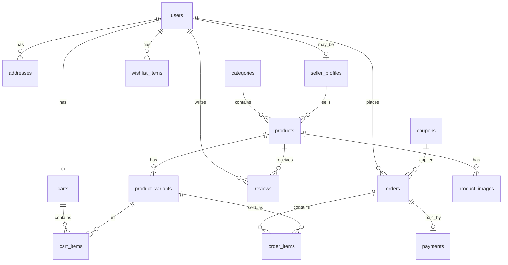

# Database Schema

Logical schema (your spec) → ShopSphere physical tables (`app/infrastructure/database/models.py`).

## Entity mapping

| Spec table | Implemented as | Field mapping |
|------------|----------------|---------------|
| **Users** | `users` + `addresses` | `name` → `full_name`; `password` → `hashed_password`; `address` → `addresses` (1‑N) |
| **Categories** | `categories` | `image` → `image_url` (+ `slug`, `parent_id`) |
| **Products** | `products` + `product_variants` + `product_images` | `price`/`stock`/`discount` → variant `price`/`stock`/`compare_at_price`; `rating` → `average_rating`; `image` → `product_images` |
| **Cart** | `carts` + `cart_items` | `product_id` → `variant_id` (SKU-level cart) |
| **Wishlist** | `wishlist_items` | Same: `user_id`, `product_id` |
| **Orders** | `orders` | `payment_status` → related `payments.status`; `shipping_address` → `shipping_address_json` |
| **Order Items** | `order_items` | `product_id`/`price` → `variant_id` + `unit_price` (+ snapshot name/SKU) |
| **Payments** | `payments` | `payment_method` → `provider`; `transaction_id` → `provider_payment_id` |
| **Coupons** | `coupons` | `discount` → `discount_type` + `discount_value`; `expiry_date` → `ends_at` |
| **Reviews** | `reviews` | `comment` → `body` (+ optional `title`) |

## Spec (logical)

```
Users          id, name, email, password, phone, role, address, created_at
Categories     id, name, description, image
Products       id, category_id, seller_id, name, description, price, discount, stock, rating, image, created_at
Cart           id, user_id, product_id, quantity
Wishlist       id, user_id, product_id
Orders         id, user_id, total, status, payment_status, shipping_address, created_at
Order Items    id, order_id, product_id, quantity, price
Payments       id, order_id, payment_method, transaction_id, amount, status
Coupons        id, code, discount, expiry_date
Reviews        id, user_id, product_id, rating, comment, created_at
```

## Physical ER (production)



## Why variants?

Amazon/Flipkart-style catalogs need **SKU-level** price and stock (size/color).  
So `price`, `discount`, and `stock` live on `product_variants`, not only on `products`.

## Extra tables (beyond the base spec)

| Table | Purpose |
|-------|---------|
| `seller_profiles` | Seller store / approval |
| `inventory_logs` | Stock movement audit |
| `notifications` | In-app alerts |
| `support_tickets` | Customer support |

## Engine

- **Dev:** SQLite (`shopsphere.db`) via `DATABASE_URL=sqlite+aiosqlite:///./shopsphere.db`
- **Prod:** PostgreSQL via Docker Compose
- **Migrations:** Alembic (`alembic/`)
- **Seed:** `python scripts/seed.py`
